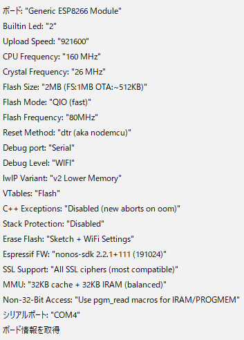

# ESP-WROOM-02 コード

## Arduino IDE

バージョン： 1.8.19
ボード： ESP8266 (3.0.2)

## セットアップ方法

- Ardino IDE を DL&インストール
- [ファイル] > [環境設定] > [追加のボードマネージャの URL]から ESP8266 のボードマネージャを設定する
  - [設定値] https://arduino.esp8266.com/stable/package_esp8266com_index.json
- [ツール] > [ボードマネージャ] 検索欄に [esp8266]を入力し、ボード 'esp8266'をインストールする(動作確認したバージョンは 3.0.2)
- Arduino IDE を再起動
- [ツール] > [ボード] > [Generic ESP8266 Module]を選択

## F マクロ関数

Fマクロ関数を使用することで、SRAM(読み書き可能なメモリ)から Flashメモリ(読み取り専用)の読み込みに変わるので、実行時に読み取られることで SRAMのメモリ使用量削減になる    
原文： https://www.arduino.cc/reference/en/language/variables/utilities/progmem/#_the_f_macro  
Arduino 日本語リファレンス: http://www.musashinodenpa.com/arduino/ref/index.php?f=0&pos=1830  
Qiita: https://qiita.com/ma2shita/items/89ed5b74698d4922efdd  

## 注意点

- ボードのバージョンを上げた後は Connectiong...\_\_\_\_... の表示時に、書き込みモード ＋ リセット を連打する
- WiFi に接続できなくなるため、 Cystal Frequency は 26MHz にする
- Debug Port を Serial、 Debug Level を任意の値に変更することで Serial 出力に ライブラリのデバッグ情報が表示される
- [ファイル] > [環境設定] > [より詳細な情報を表示する] の コンパイルにチェックすると、コンパイル時に詳細情報が表示される
- [ファイル] > [スケッチ例] でスケッチ例を ESP-WROOM-02 の開発に役立つスケッチ例を確認できる 今回のコードは [スケッチ例] > [DNSServer] > [CaptivePortalAdvanced]を参考にした

## ESP8266 ボード設定例

